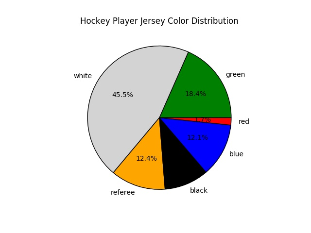
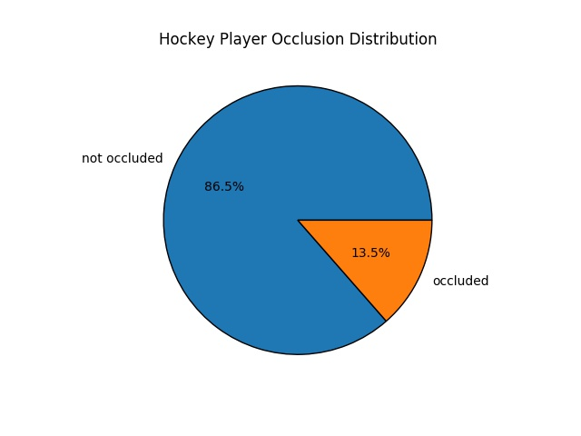

## PuckYeah: McGill Hockey Player Tracking Dataset (MHPTD)

Following the same format as the MOT challenge dataset, this dataset labels hockey players instead of pedestrians. 

### Citation
If you find this dataset useful to your research, please cite the following article

```
@article{MHPTD,
  title={A Method for Tracking Hockey Players by Exploiting Multiple Detections and Omni-Scale Appearance Features},
  author={Yingnan Zhao, Zihui Li, Kua Chen},
  journal={Project Report},
  year={2020}
}
```

The dataset follows the same format as the popular [MOT challenge dataset](https://motchallenge.net/) for pedestrian tracking. An entry in the dataset representing an instance of a player is shown in Table below. The only significant difference between the HPDT and the MOT challenge dataset is the way identity is assigned. Our HPDT dataset assigns identity at a personal level, and the MOT challenge assigns identity at a tracklet level. To be specific, when a person exits and then re-enters the field of view, this person will produce two tracklets. The MOT challenge dataset assigns two unique identities to each one of them, whereas the hockey dataset assigns the same identity to both tracklet.

|frame number|Player Id|left corner x|left corner y|height|width|detection confidence|tracklet id|visibility|
|------------|---------|-------------|-------------|------|-----|--------------------|-----------|------------|
|1|24|655|245|81|50|1|14|0.5|

An entry of the dataset

Note: The visibility column represents whether a player is occluded or not, and the detection confidence is always one because the dataset was annotated manually.

### Dataset Analysis and Statistics

The dataset consists of 25 high definition NHL gameplay video clips, and each clip contains one shot of the gameplay from the overhead camera position. A shot is defined as a series of frames that run for an uninterrupted period of time without cut or camera switch. There are two popular NHL broadcast video frame rates that are available on the market: 60 frames per second (fps) and 30 fps. To account for this situation, half the video clips in the dataset have a frame rate of 30 fps, and the other half have a frame rate of 60 fps. An open-source video annotation tool called [Computer Vision Annotation Tool (CVAT)](https://github.com/opencv/cvat) was used to annotate the videos.

|Clip name|frames|bounding boxes|tracklets|fps|length (sec)|
|--------|-------|--------------|---------|---|-----------|
|all_star_2009_001|1670|11022|36|30|55.6|
|all_star_2009_002|1964|12515|54|30|65.4|
|all_star_2009_003|1837|11772|47|30|61.2|
|all_star_2009_004|3946|22797|114|30|131.5|
|all_star_2009_005|2065|11742|56|30|68.8|
|all_star_2009_006|2645|15693|79|30|88.2|
|CHI_TOR_2016_001|2370|20021|108|30|79|
|CHI_TOR_2016_002|1582|14112|52|30|52.7|
|CHI_TOR_2016_003|1066|7641|55|30|35.5|
|CHI_TOR_2016_004|1617|13858|60|30|53.9|
|PIT_VS_SJ_001|1390|10824|58|30|46.3|
|PIT_VS_SJ_002|2762|21314|109|30|92.1|
|PIT_VS_SJ_003|3525|27645|151|30|117.5|
|PIT_VS_WAS_001|2980|25401|75|30|99.3|
|CAR_BOS_2019_001|6516|53283|154|60|108.6|
|CAR_BOS_2019_002|2643|22761|62|60|44.05|
|STL_SAJ_2009_001|5646|40611|130|60|94.1|
|STL_SAJ_2009_002|3808|29108|91|60|63.5|
|STL_SAJ_2009_003|6026|40218|72|60|100.4|
|CAR_VS_NYR_001|5342|45768|95|60|89|
|CAR_VS_NYR_002|4282|37843|87|60|71.4|
|CAR_VS_NYR_003|4878|42151|105|60|81.3|
|CGY_VS_DAL_001|3969|32840|70|60|66.15|
|CGY_VS_DAL_002|4168|36283|95|60|69.4|
|CGY_VS_DAL_003|3608|25562|41|60|60.1|
|total|82305|632785|2056|N/A|1895.4|

As shown in the figure below, almost half of the players wear white-colored jerseys. Similar proportions of players are wearing blue, green and black sweaters. Only 1.7% of the players in the dataset are wearing red-colored jerseys



the dataset is well-balanced in terms of types of skaters on the ice. The number of home players and home goalies is similar to the number of away players and away goalies.


There are two factors that can also have an impact on the tracker performance: occlusion between players and the visibility of the player’s jersey number. In the MHPTD dataset, a bounding box is labeled “occluded” when more than 10% of the enclosing player visually overlaps with another player. Due to the physical nature of hockey, occlusions happen very often. About 13.5% of the player instances are occluding another player



During the tracking process, the ability to distinguish and reidentify players based on the their appearance features is vital to the tracker’s performance. However, since players on the same team wear the same colored jerseys, they have similar appearances, and the most distinctive appearance feature is the number printed on the back of the jersey. If the number is not visible, this will increase the difficulty of distinguishing players from the same team significantly. As shown in the figure below, a portion (27.5%) of the tracklets cannot be identified by player number. 


